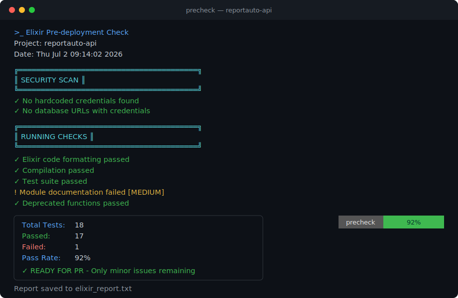

# Precheck

[](https://github.com/bennydreamtech23/precheck-developer/actions/workflows/ci.yml)
[](#score-badge)

Precheck is an open-source pre-deployment validation toolkit for Elixir and Node.js projects.



This repository is now the single source of truth for development, installation, and releases.

## Install

### One-line install

```bash
curl -fsSL https://raw.githubusercontent.com/bennydreamtech23/precheck-developer/master/scripts/install.sh | bash
```

### Local install from source

```bash
git clone https://github.com/bennydreamtech23/precheck-developer.git
cd precheck-developer
./scripts/install.sh
```

### Update to latest (if already installed)

If `precheck` is already on your system, rerun the installer to pull the latest scripts:

```bash
curl -fsSL https://raw.githubusercontent.com/bennydreamtech23/precheck-developer/master/scripts/install.sh | bash
hash -r
precheck --help
```

If you want a clean reinstall, remove the old install first, then install again:

```bash
rm -rf "$HOME/.precheck" "$HOME/.precheck_config"
sudo rm -f /usr/local/bin/precheck 2>/dev/null || true
rm -f "$HOME/.local/bin/precheck"
curl -fsSL https://raw.githubusercontent.com/bennydreamtech23/precheck-developer/master/scripts/install.sh | bash
hash -r
precheck --help
```

## Usage

Run inside your project directory:

```bash
precheck
```

Common options:

```bash
precheck --help
precheck --setup
precheck --debug
```

## What It Checks

- Project type detection (Elixir or Node.js)
- Dependency/security checks
- Build and test readiness checks
- Basic secrets and hardcoded credential detection
- Environment and configuration hygiene checks

## Reports

Every run writes a plain-text report (`elixir_report.txt` / `secrets_scan_report.txt`) next to your project — same content as the colored terminal output, with ANSI color codes stripped so it's readable in an editor, PR comment, or CI log.

Want a shareable PDF instead? Pass `--pdf` (requires `pandoc`, or `enscript` + `ghostscript`):

```bash
precheck --pdf
```

## Score Badge

Precheck includes a hosted badge service, so consuming repositories do **not** need to create a GitHub Gist, Cloudflare account, Pages site, or manage their own badge infrastructure.

The badge only updates when `precheck` actually runs in GitHub Actions - that's the one requirement. It reports its score automatically (via `GITHUB_ACTIONS`/`GITHUB_REPOSITORY`, both set by GitHub itself), so there's nothing to configure beyond making sure a CI job actually runs it.

### Requirement: a CI job that runs `precheck`

Add a job like this (adjust `elixir-version`/`otp-version` to your project, or swap in `nodejs_precheck.sh`'s setup for a Node.js project):

```yaml
jobs:
  precheck:
    runs-on: ubuntu-latest
    steps:
      - uses: actions/checkout@v4

      - name: Setup Elixir
        uses: erlef/setup-beam@v1
        with:
          elixir-version: "1.18.4"
          otp-version: "27.3"

      - name: Install precheck
        run: curl -fsSL https://raw.githubusercontent.com/bennydreamtech23/precheck-developer/master/scripts/install.sh | bash

      - name: Run precheck
        run: precheck --github
```

Two things this depends on that are easy to miss:

- **Elixir/Node must be set up in that job** (`erlef/setup-beam` above) _before_ `precheck` runs - without it, `precheck` exits immediately at its own tool-check step and never reaches the part that reports the score.
- **The installer URL must be the real one** shown above - a placeholder or typo'd URL fails with `Could not resolve host`, and `precheck: command not found` right after it.

`precheck` exits non-zero when it finds CRITICAL issues (failing tests, compile warnings, etc.) - the same way `mix test` failing would. That's fine when `precheck` is the _only_ thing in a job, but if it runs in a job alongside other, unrelated jobs in the same workflow (e.g. a separate `ci` job doing your real format/compile/test checks), a CRITICAL finding here makes the _whole workflow's_ conclusion `failure` even when those other jobs passed - which can unexpectedly block anything gated on that workflow, such as a `workflow_run`-triggered deploy.

The `--github` flag (shown in the snippet above) avoids this: `precheck` still runs every check and still reports the real score to the badge, it just always exits `0`, so this step alone can never block unrelated jobs. Treat it as advisory in CI - use the badge or the downloaded report (see below) to see the real result, and let your actual test/compile job be the thing that gates deploys.

### Downloading the report from CI

Add an upload step after `precheck --github` runs, so the plain-text report is attached to the workflow run instead of only existing on the ephemeral runner:

```yaml
- name: Upload precheck report
  if: always()
  uses: actions/upload-artifact@v4
  with:
    name: precheck-report
    path: elixir_report.txt
```

It'll show up under the run's **Artifacts** section on the Actions summary page.

### Add the badge to your README

Replace `OWNER` and `REPO` with your GitHub repository owner and name:

```md

```

### Security and transparency

The Elixir and Node.js scripts contain a shared `PRECHECK_BADGE_TOKEN` used when reporting badge scores to the hosted service.

This is **intentional**.

Because Precheck aims for a zero-configuration experience, requiring every developer to create and manage their own API token would add unnecessary setup complexity. Instead, a shared token is embedded in the public scripts so badge publishing works immediately after installation.

This token is **not treated as a secret** and should not be considered a security boundary. Anyone inspecting the source code can see it.

The token exists only to reduce accidental or casual requests to the badge service. It is **not** intended to prevent a determined actor from submitting badge data, and it must never be reused for authentication or any operation requiring real security.

Since badge scores are informational rather than security-sensitive, this trade-off was made deliberately to provide a much simpler developer experience.

## Repository Structure

- `scripts/` shell-based runtime checks and installer
- `lib/` Elixir CLI and scanning logic
- `.github/workflows/` CI and release automation
- `test/` Elixir test suite

## Development

```bash
mix deps.get
mix test
./scripts/universal_precheck.sh --help
```

Optional local validation:

```bash
./scripts/validate_fixes.sh
```

## Reusable GitHub Actions Workflows

This repository can also act as a shared GitHub Actions workflow source for Elixir and Phoenix applications.

### Why there are two workflow files

The reusable workflows are split on purpose:

- `.github/workflows/elixir-ci.yml` handles CI checks only: formatting, compilation, tests, and the final `ci-required` status check.
- `.github/workflows/elixir-deploy.yml` handles deployment only: production setup plus a caller-provided deploy command.

Keeping CI and CD separate makes it easier for application repositories to:

- use a tiny caller workflow for pull requests and pushes
- keep deployment triggers and secrets separate from CI
- require only one stable check in branch protection: `ci-required`

### How another repository uses this repo

An application repository does not copy the full workflow logic. Instead, it creates a small workflow file that calls one of the reusable workflows in this repository with `uses:`.

Typical setup in an Elixir or Phoenix app repo:

1. Add `.github/workflows/ci.yml` to call the shared CI workflow.
2. Add `.github/workflows/deploy.yml` to call the shared deploy workflow.
3. In branch protection or a GitHub ruleset, require only `ci-required`.

### Shared CI workflow

Use [.github/workflows/elixir-ci.yml](./.github/workflows/elixir-ci.yml) from an application repository to run formatting, compilation, and tests through `workflow_call`.

Example caller workflow for a Phoenix app on `master`:

```yaml
name: CI

on:
  pull_request:
  push:
    branches:
      - master

jobs:
  ci:
    uses: bennydreamtech23/precheck-developer/.github/workflows/elixir-ci.yml@master
    with:
      elixir_version: "1.17.3"
      otp_version: "27.1"
      postgres_version: "16"
```

The shared CI workflow exposes stable job names:

- `format`
- `compile`
- `test`
- `ci-required`

In the caller repository, set branch protection or a ruleset to require only `ci-required`. This keeps required checks stable even though the reusable workflow still runs the underlying jobs separately.

What the CI caller does:

- checks out the caller repository code
- runs `mix format --check-formatted`
- runs `mix compile --warnings-as-errors`
- runs `mix test` with PostgreSQL
- publishes one final stable required check: `ci-required`

### Shared CD workflow

Use [.github/workflows/elixir-deploy.yml](./.github/workflows/elixir-deploy.yml) when an application repository wants a tiny deployment wrapper while keeping the actual deployment logic centralized here.

Example caller workflow:

```yaml
name: Deploy

on:
  workflow_dispatch:

jobs:
  deploy:
    uses: bennydreamtech23/precheck-developer/.github/workflows/elixir-deploy.yml@master
    with:
      environment: production
      elixir_version: "1.17.3"
      otp_version: "27.1"
      working_directory: .
      deploy_command: mix release
    secrets: inherit
```

The deploy workflow is intentionally generic. Replace `deploy_command` and, if needed, extend the placeholder `deploy_token` secret wiring for the target platform you actually use.

What the CD caller does:

- checks out the caller repository code
- sets up the requested Elixir and OTP versions
- installs production dependencies
- compiles the application
- runs the deployment command provided by the caller repository

Example layout in an app repo:

```text
.github/workflows/
├── ci.yml
└── deploy.yml
```

### Secrets and sharing notes

Use `secrets: inherit` in the caller workflow when the called workflow should receive the caller repository's available secrets instead of mapping them one by one. GitHub documents this pattern for reusable workflows called within the same organization or enterprise. If that does not match your setup, map the required secrets explicitly under `jobs.<job_id>.secrets`.

Reusable workflow constraints to keep in mind:

- Pinning to a tag or commit SHA is safer than a branch ref. The examples here use `@master` because that is the current branch, but a version tag or SHA is better for long-term stability.
- Public caller repositories can use reusable workflows from public repositories. Private caller repositories can use public workflows and can use private shared workflows when access is enabled in the called repository's Actions settings.
- If this repository is private, its Actions settings must explicitly allow access from the private repositories that will call these workflows.
- If you make a private workflow repository accessible to other private repositories, GitHub notes that outside collaborators on those caller repositories may be able to view logs from runs that use the shared workflow.
- GitHub warns that job names used as required checks should be unique across workflows. In practice, require only `ci-required` in the caller repo and avoid creating another job with the same name there.
- Workflow-level `env` values from the caller do not automatically propagate into the called workflow. Pass values with inputs, `vars`, or secrets instead.
- Environment secrets cannot be passed through `workflow_call`. If the deploy workflow uses `environment`, GitHub uses that environment's secrets for the deploy job.
- GitHub does not support redirects for actions or reusable workflows, so if the repository or workflow path changes, callers must update their `uses:` reference.

## Release

Tag-based release builds happen in this repository:

```bash
git tag v1.0.0
git push origin v1.0.0
```

Release workflow builds the escript, packages scripts + docs, and publishes GitHub release assets with checksums.

## Security Notes

- The project uses script-first and Elixir-based scanning for portability.
- Legacy Rust artifacts were removed and are not part of runtime, CI, or release packaging.

  ## Star the Repo

  If you find this project useful, please consider giving it a ⭐ and sharing it with others.

## Contributing

External contributors must fork this repository before contributing.

See the full guide in [CONTRIBUTING.md](./CONTRIBUTING.md).

## License

MIT - see `LICENSE`.
